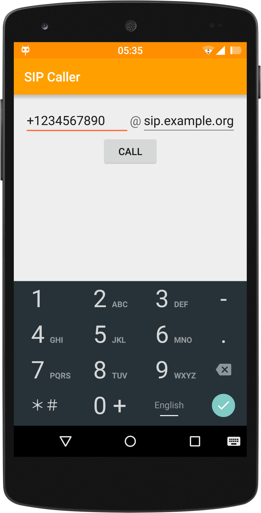

SIP Caller
==========

Stock Android dialer (which is also used in CyanogenMod) does not support
dialing SIP numbers directly; the only way to do it is to add a contact
or run `am start -a android.intent.action.CALL sip:...` in terminal.

SIP Caller is an app that allows dialing SIP numbers:

License
-------

[MIT License](LICENSE.txt)